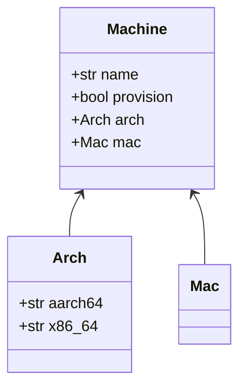
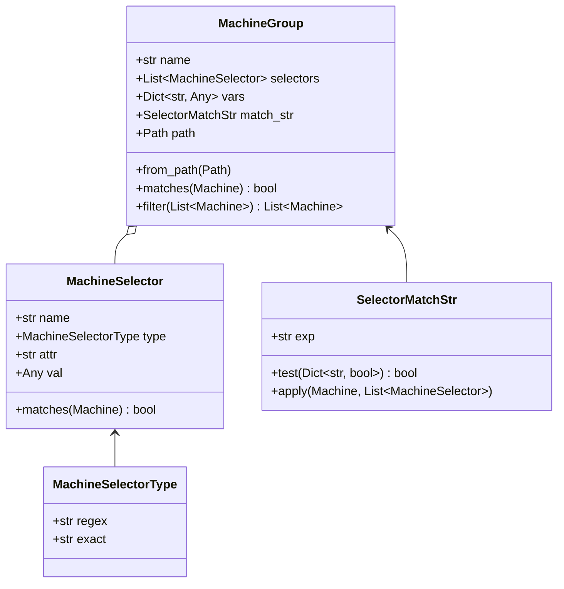
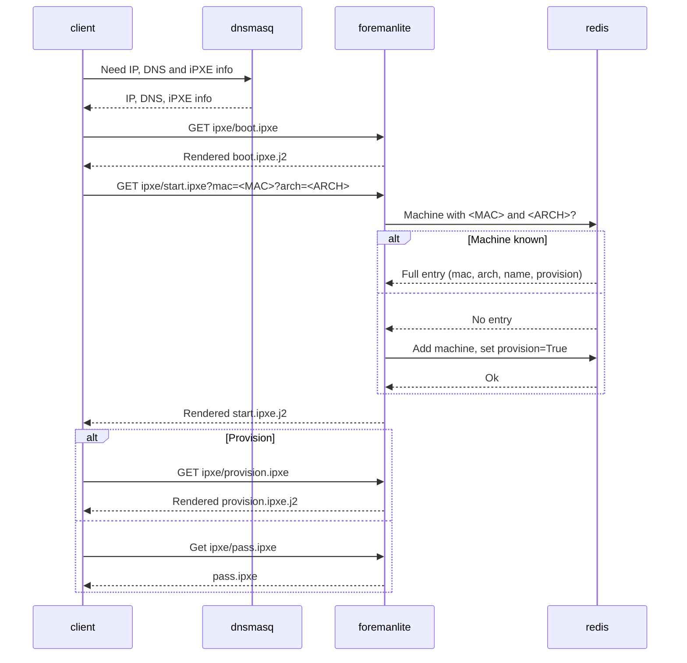

# foremanlite

Lightweight, container-based, bare-bones alternative to [The Foreman](https://theforeman.org), inspired by [poseidon's](https://github.com/poseidon) [matchbox](https://github.com/poseidon/matchbox) project.

This README provides a quick overview for the project. For more information, please reach out to me at `learnitall0@gmail.com` or check out how I use foremanlite in my own homelab, [yaghl](https://github.com/learnitall/yaghl).

## Installing

foremanlite is packaged with [poetry](https://python-poetry.org). Please see poetry's documentation for more information on how it can be used to build and install foremanlite. For a TL;DR though:

```bash
$ git clone https://github.com/learnitall/foremanlite
$ cd foremanlite
$ poetry build  # build wheels
$ poetry install # create new venv with foremanlite installed
$ pip install .  # install with pip
```

A Containerfile is also included, based on [python:3.10-slim](https://hub.docker.com/_/python). The file `scripts/build.sh` can be used to build the foremanlite container and tag it with the appropriate version. It needs to be run from the project's root within a virtual environment that has foremanlite installed:

```bash
$ git clone https://github.com/learnitall/foremanlite
$ cd foremanlite
$ poetry install
$ poetry run scripts/build.sh
```

The `Containerfile` is setup to install foremanlite into a virtual environment during a build stage, which is then copied into the final image. To activate the virtual environment inside a foremanlite container, use `/app/.venv/bin/activate`:

```console
$ podman exec -it foremanlite /bin/bash
# . .venv/bin/activate
```

Please take a look at the `Containerfile` for an explanation of why this choice was made to use a dedicated python virtual environment within the container image.

## Overview

foremanlite tries to facilitate the lifecycle of iPXE-provisioned machines with a templatable chainloading workflow and 'bring your own network environment' mindset. Unlike The Foreman, which provides options for facilitating DHCP, DNS, tftp, etc., foremanlite is just an HTTP server that provides a powerful REST API to help provision machines with iPXE.

There are two important concepts which dictate how this whole process works: `Machine`s and `MachineGroup`s. Here's an abridged overview of how these are put together.

### Machines



A machine has four attributes:

1. **Name**: human-readable name for the machine.
2. **Provision**: boolean describing if the machine should or should not be provisioned on next boot.
3. **Arch**: architecture of the machine, one of `x86_64` or `aarch64`. New values can be added by modifying `foremanlite.machine.Arch`, which is just a string-based `Enum`.
4. **Mac**: mac address of the machine, in the format of `00-11-22-33-44-55`.

A machine is uniquely identified through its Mac and Arch attributes. See `foremanlite.machine.get_uuid`.

### Machine Groups



The `MachineGroup` class defines a group of `Machines` and the variables which are to be associated with them. These variables can be used in template files served to client machines to dynamically configure how they are provisioned.

`MachineSelector` and `SelectorMatchStr` determine how `Machine`s are assigned into a `MachineGroup`.`MachineSelector` defines an attribute of a `Machine` to match on and how, whether exactly or through a regex expression. If more than one selector is given to a group, then they will all be OR-ed together. A `SelectorMatchStr` can be used to logically combine `MachineSelector`s together to create more complex matching criteria.

`MachineGroup`s are configured by defining them within `json` files and then plopping them into a directory, such as `/etc/foremanlite/groups/`, which is then managed by another class called a `MachineGroupSet`. This object loads and updates `MachineGroup`s from the target directory over the lifetime of foremanlite's execution, allowing for on-the-fly editing.

### Example

Let's say we have the following machines:

```json
[
{
    "name": "Worker One",
    "arch": "aarch64",
    "provision": True,
    "mac": "11-22-33-44-55-66"
},
{
    "name": "Worker Two",
    "arch": "x86_64",
    "provision" True,
    "mac": "11-22-33-44-55-77"
},
{
    "name": "Controller One",
    "arch": "aarch64",
    "provision": True,
    "mac": "88-88-77-66-11-22"
}
]
```

Our worker machines and controller machine have different binaries which they need to download and run on startup. We can use variables defined within `MachineGroup`s to render our startup script differently depending on which machine requests it.

For instance, if we have the following script:

```bash
#!/bin/bash
# startup.sh.j2

BINARY_URL=https://my-binary.io/{{ version }}/{{ node_type }}/{{ arch }}
curl -sfL "$BINARY_URL" | sh -
```

Which uses the following variables:

* `{{ version }}`: The version of our target binary.
* `{{ node_type }}`: Either `controller` or `worker`.
* `{{ arch }}`: Machine's architecture as a string, ie `x86_64` or `aarch64`.

We can define the following groups:

> /etc/foremanlite/groups/workers.json
```json
{
    "name": "workers",
    "selectors": [
        {
            "type": "exact",
            "attr": "mac",
            "val": "11-22-33-44-55-66"
        },
        {
            "type": "exact",
            "attr": "mac",
            "val": "11-22-33-44-55-77"
        }
    ],
    "vars": {
        "node_type": "worker"
    }
}
```

> /etc/foremanlite/groups/controllers.json
```json
{
    "name": "controllers",
    "selectors": [
        {
            "type": "exact",
            "attr": "mac",
            "val": "88-88-77-66-11-22"
        }
    ],
    "vars": {
        "node_type": "controller"
    }
}
```

> /etc/foremanlite/groups/global.json
```json
{
    "name": "global",
    "selectors": [
        {
            "type": "regex",
            "attr": "mac",
            "val": ".*"
        }
    ],
    "vars": {
        "version": "2.3"
    }
}
```

Now when our startup script is rendered and served to each client, its behavior will change appropriately:

| Worker         | BINARY_URL                                    |
| -------------- | --------------------------------------------- |
| Worker One     | `https://my-binary.io/2.3/worker/aarch64`     |
| Worker Two     | `https://my-binary.io/2.3/worker/x86_64`      |
| Controller One | `https://my-binary.io/2.3/controller/aarch64` |


## Boot Process

Here's the boot sequence that foremanlite is configured for out-of-the-box:



In order to provide the correct iPXE files, foremanlite first needs to identity the machine it is working with. `boot.ipxe` grabs the machine's arch and Mac address and passes them along to foremanlite through a request to chainload `start.ipxe`.

`start.ipxe` chainloads either `provision.ipxe` or `pass.ipxe` depending on the machine's provision attribute. If the machine hasn't been seen before, then it's provision attribute will be set to `True` by default.

When a client receives `provision.ipxe`, the iPXE file set through a machine's `chain_file` variable will be chainloaded. If the `chain_file` variable is not set, then a default provisioning option will be used instead (right now this is [netboot.xyz](https://netboot.xyz)).

When a client receives `pass.ipxe`, the machine will exit out of the iPXE boot process and continue on with the other boot options it has available. As mentioned previously, this allows for the provisioning of a machine to be toggled by setting the `provision` attribute to either `True` or `False`.

The files `boot.ipxe`, `start.ipxe`, `provision.ipxe` and `pass.ipxe` are all included by default with foremanlite to provide a boot sequence, however these files can be changed for whatever your needs may be.

## CLI

foremanlite's CLI is built using [click](https://click.palletsprojects.com/en/8.0.x/), with all of the source code for it placed under `foremanlite/cli`. It can be accessed by invoking the `foremanlite.cli` module:

```console
$ python -m foremanlite.cli
Usage: python -m foremanlite.cli [OPTIONS] COMMAND [ARGS]...

  Foremanlite CLI.

Options:
  --verbose / --no-verbose        Enable verbose logging
  --quiet / --no-quiet            Disable printing logs to screen
  --log-dir TEXT                  Provide path to log directory. File rotation
                                  is used.
  --persist-log / --no-persist-log
                                  Persist logs to disk at given log dir.
  --config-dir TEXT               Path to configuration directory.
  --redis / --no-redis            Use redis to handle tracking machine state.
  --redis-url TEXT                Connection URI to Redis server.
  --output-gunicorn-logs / --no-output-gunicorn-logs
                                  Print gunicorn logs to the screen
  --gunicorn-layer-default / --no-gunicorn-layer-default
                                  Layer gunicorn config on top of the default
                                  gunicorn config. This lets user
                                  configurations use and override variables in
                                  the gunicorn config.
  --max-cache-file-size INTEGER   Max file size that will be cached (in bytes)
  --config FILE                   Read configuration from FILE.
  --help                          Show this message and exit.

Commands:
  groups    Print all known groups in json and exit.
  machines  Subcommands for working with machines.
  start     Start foremanlite server.
  version   Print version and exit.
```

The CLI is mainly used for starting foremanlite's REST API, populating and editing machines, and for debugging groups.

## REST API

foremanlite's REST API is built using [flask-restx](https://flask-restx.readthedocs.io/en/latest/), which facilitates building documentation with [swagger](https://swagger.io/). All code for the API is placed under `foremanlite/serve`. To access the swagger documentation, spin up foremanlite and make a request to the root URL in a browser:

```bash
podman run --rm -it -p 8080:8080 foremanlite start --verbose --no-redis
```

The REST API is basically just used as a templatable file server, but it can also be used to manage machines and their attributes. 

All templates are rendered using [Flask's template rendering functions](https://flask.palletsprojects.com/en/2.0.x/quickstart/#rendering-templates). This means that provisioning loops can be resolved within iPXE files themselves, thanks to [imgfetch](https://ipxe.org/cmd/imgfetch) and Flasks' [url_for](https://flask.palletsprojects.com/en/2.0.x/api/#flask.url_for):

```
imgfetch {{ url_for("update_machine", _external=True) }}?arch=${arch}&mac=${mac:hexhyp}&name={{ name }}&provision=false
```

## Configuring

foremanlite is configured through a hierarchical 'configuration directory', which holds data that can be served to clients, machine group definitions, third-party executables and gunicorn configuration. These locations can be adjusted by editing the values in `foremanlite/vars.py`, but here's a description of each default directory as it's shipped:

* `data/butane`. CoreOS `.bu` files.
* `data/ignition`. CoreOS `.ign` files.
* `data/ipxe`. iPXE files.
* `data/staic`. Static, non-templatable files, such as `.img` files.
* `data/templates`. Generic jinja2 template files.
* `exec/`. Executables (ie butane) and gunicorn configuration.
* `groups/`. `MachineGroup` json files. Must end in `.json`.

Runtime configuration can be set using the CLI. If you'd like to store runtime CLI options in a configuration file, rather than passing as arguments, just take the CLI argument, remove the `--` out front, and pop it into a file.

For instance, `--verbose --log-dir=/var/log/foremanlite --no-redis` turns into:

```
verbose: true
log-dir: /var/log/foremanlite
no-redis: true
```

## Contributing

There are two things to consider before opening a PR: linting and testing. Linting is performed with the help of [pre-commit](https://pre-commit.com), which runs hooks for checking style, typing and syntax. Testing is performed using [tox](https://tox.wiki)-invoked [pytest](https://docs.pytest.org) and is mainly used for regressing testing and hypothesis testing on foremanlite's core library components.

Here are the main technologies and dependencies that foremanlite uses:

* [flask](https://flask.palletsprojects.com/en/2.0.x/)
* [flask-restx](https://flask-restx.readthedocs.io/en/latest/)
* [gunicorn](https://gunicorn.org/)
* [pydantic](https://pydantic-docs.helpmanual.io/)
* [click](https://click.palletsprojects.com/en/8.0.x/)

All in all, if you have any bugs, ideas, questions, please feel free to raise an issue or PR. Thank you!
